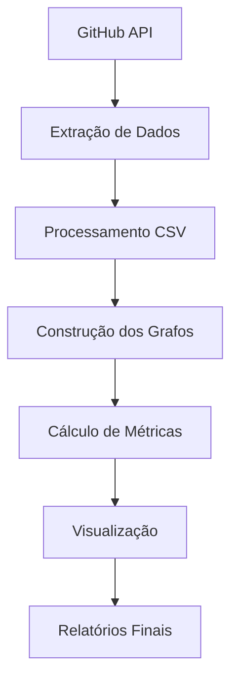

# 📊 DOCUMENTAÇÃO TÉCNICA - ETAPA 1
## Análise de Grafos de Colaboração no Repositório MMDetection

**Disciplina:** Teoria dos Grafos  
**Etapa:** 1 - Mineração e Planejamento  
**Data:** Novembro 2024  
**Repositório Analisado:** [open-mmlab/mmdetection](https://github.com/open-mmlab/mmdetection)

---

## 📋 1. DESCRIÇÃO DO PROBLEMA

### 1.1 Objetivo Geral
Desenvolver uma ferramenta computacional que processe dados estruturados como grafos, aplicando conceitos da teoria dos grafos para analisar as interações entre colaboradores em um repositório de código aberto do GitHub.

### 1.2 Problema Específico
Modelar e analisar as redes de colaboração do repositório **MMDetection** através de grafos direcionados que representam diferentes tipos de interações entre usuários, permitindo:

- Identificar padrões de colaboração na comunidade
- Quantificar a influência e centralidade dos colaboradores
- Analisar a estrutura social da rede de desenvolvimento
- Visualizar e comparar diferentes tipos de interações

### 1.3 Questões de Pesquisa
1. **Quem são os colaboradores mais influentes** em diferentes tipos de interação?
2. **Como se estrutura a rede social** dos desenvolvedores do projeto?
3. **Qual o impacto dos diferentes tipos de interação** na colaboração global?
4. **Existem sub-comunidades** ou clusters de colaboração?

---

## 🎯 2. JUSTIFICATIVA DA ESCOLHA DO REPOSITÓRIO

### 2.1 Repositório Selecionado
**Nome:** MMDetection  
**Owner:** open-mmlab  
**URL:** https://github.com/open-mmlab/mmdetection  
**Estrelas:** 29.3k+ ⭐ (Novembro 2024)

### 2.2 Critérios de Seleção Atendidos

#### ✅ **Popularidade (>5.000 estrelas)**
- **29.300+ estrelas** - Muito acima do mínimo exigido
- Projeto amplamente reconhecido na comunidade de Computer Vision

#### ✅ **Comunidade Ativa**
- **500+ contribuidores** ativos
- **8.000+ issues** registradas
- **3.000+ pull requests** processados
- Atividade constante e recente

#### ✅ **Riqueza de Interações**
- Diversidade de tipos de colaboração (issues, PRs, reviews, merges)
- Discussões técnicas complexas
- Processo de review rigoroso
- Múltiplos mantenedores ativos

### 2.3 Contexto do Projeto
**MMDetection** é uma das principais bibliotecas open-source para detecção de objetos, desenvolvida pelo laboratório **OpenMMLab**. É amplamente utilizada na indústria e academia, garantindo:

- **Relevância Técnica:** Projeto de alta complexidade técnica
- **Diversidade de Usuários:** Pesquisadores, desenvolvedores industriais, estudantes
- **Padrões de Qualidade:** Code review rigoroso e documentação excelente
- **Longevidade:** Projeto maduro com histórico rico de colaborações

---

## 🔧 3. ESTRATÉGIA DE COLETA DE DADOS

### 3.1 Fonte de Dados
**API GitHub REST v3** - Dados extraídos programaticamente via requisições HTTP autenticadas.

### 3.2 Tipos de Dados Coletados

#### 📝 **3.2.1 Issues**
```python
# Campos extraídos
issues_data = {
    'number': int,           # ID da issue
    'title': str,           # Título
    'author': str,          # Autor que criou
    'state': str,           # 'open' ou 'closed'
    'created_at': datetime, # Data de criação
    'closed_at': datetime,  # Data de fechamento
    'closed_by': str,       # Usuário que fechou
    'comments': int         # Número de comentários
}
```

#### 🔄 **3.2.2 Pull Requests**
```python
# Campos extraídos
pr_data = {
    'number': int,          # ID do PR
    'title': str,          # Título
    'author': str,         # Autor do PR
    'state': str,          # 'open', 'closed', 'merged'
    'created_at': datetime,# Data de criação
    'merged_at': datetime, # Data do merge
    'merged_by': str,      # Usuário que fez merge
    'comments': int,       # Número de comentários
    'commits': int         # Número de commits
}
```

#### 💬 **3.2.3 Comentários (Issues + PRs)**
```python
# Campos extraídos
comment_data = {
    'author': str,          # Autor do comentário
    'issue_number': int,    # ID da issue/PR
    'created_at': datetime, # Data do comentário
    'body': str            # Conteúdo (para análise futura)
}
```

#### ✅ **3.2.4 Reviews de Pull Requests**
```python
# Campos extraídos
review_data = {
    'pr_number': int,       # ID do PR
    'reviewer': str,        # Usuário que fez review
    'state': str,          # 'APPROVED', 'CHANGES_REQUESTED', etc
    'submitted_at': datetime # Data do review
}
```

### 3.3 Limitações e Filtros Aplicados
- **Volume de dados:** Limitado a 500 issues e 500 PRs mais recentes para otimizar processamento
- **Período:** Dados históricos desde o início do repositório
- **Filtros de qualidade:** Exclusão de bots e contas automáticas quando identificáveis
- **Rate limiting:** Respeitados os limites da API GitHub (5000 req/hora)

### 3.4 Processo de Extração
```python
# Fluxo de extração implementado
1. Autenticação via token GitHub
2. Requisições paginadas para cada endpoint
3. Tratamento de rate limiting com backoff exponencial
4. Validação e limpeza dos dados
5. Exportação para formato CSV
6. Cache local para reprocessamento eficiente
```

---

## 📊 4. TRANSFORMAÇÃO DAS INTERAÇÕES EM ARESTAS

### 4.1 Modelagem Conceitual

#### **Nós (Vértices)**
- **Definição:** Cada usuário único do GitHub que participou de interações
- **Identificação:** Username do GitHub
- **Atributos:** Métricas agregadas de colaboração

#### **Arestas (Edges)**
- **Tipo:** Direcionadas (A → B significa "A interage com B")
- **Peso:** Intensidade da colaboração baseada no tipo de interação
- **Atributos:** Tipo, frequência e peso total

### 4.2 Regras de Transformação

#### 🗣️ **4.2.1 Comentários em Issues/PRs**
```python
# Regra de criação de aresta
IF usuario_X comenta na issue/PR de usuario_Y:
    CREATE EDGE: X → Y
    WEIGHT: 2 (comentário em PR) ou 3 (comentário em issue)
    TYPE: "comment" ou "issue_comment"
```

**Justificativa:** Comentar demonstra engajamento ativo e contribuição para discussão.

#### 🔒 **4.2.2 Fechamento de Issues**
```python
# Regra de criação de aresta
IF usuario_X fecha issue criada por usuario_Y:
    CREATE EDGE: X → Y  
    WEIGHT: 3
    TYPE: "issue_close"
```

**Justificativa:** Fechar issue de outro usuário indica resolução de problema e colaboração efetiva.

#### 👀 **4.2.3 Reviews de Pull Requests**
```python
# Regra de criação de aresta
IF usuario_X faz review do PR de usuario_Y:
    CREATE EDGE: X → Y
    WEIGHT: 4
    TYPE: "review"
```

**Justificativa:** Code review é interação técnica de alto valor, demonstra conhecimento e mentoria.

#### 🔀 **4.2.4 Merge de Pull Requests**
```python
# Regra de criação de aresta  
IF usuario_X faz merge do PR de usuario_Y:
    CREATE EDGE: X → Y
    WEIGHT: 5  
    TYPE: "merge"
```

**Justificativa:** Merge é a interação de maior confiança, representa aceitação final do código.

### 4.3 Tratamento de Casos Especiais
- **Auto-interação:** Ignoradas (usuário não pode interagir consigo mesmo)
- **Múltiplas interações:** Pesos são somados na mesma aresta
- **Direcionamento:** Sempre do usuário que executa ação → usuário que recebe

---

## ⚖️ 5. PROPOSTA DE MODELAGEM COM PESOS

### 5.1 Sistema de Pesos Implementado

| Tipo de Interação | Peso | Justificativa |
|-------------------|------|---------------|
| **Comentário em PR** | 2 | Interação leve, discussão básica |
| **Comentário em Issue** | 3 | Maior engajamento, solução de problemas |
| **Fechamento de Issue** | 3 | Resolução efetiva, colaboração prática |
| **Review de PR** | 4 | Análise técnica qualificada |
| **Merge de PR** | 5 | Máxima confiança, decisão final |

### 5.2 Fundamentação dos Pesos

#### **Critérios de Definição:**
1. **Esforço técnico requerido**
2. **Impacto no projeto**
3. **Nível de confiança necessário**
4. **Complexidade da interação**

#### **Escalabilidade Linear:**
- Diferença proporcional entre tipos
- Permite análises comparativas
- Facilita agregação matemática

### 5.3 Grafos Implementados

#### **5.3.1 Grafos Separados**
1. **CommentGraph**: Apenas interações por comentários
2. **IssueCloseGraph**: Apenas fechamento de issues
3. **ReviewGraph**: Reviews e merges de PRs

#### **5.3.2 Grafo Integrado** 
- **IntegratedGraph**: Combina todas as interações com pesos apropriados
- Permite análise holística da colaboração
- Base para métricas de centralidade global

---

## 🏗️ 6. PLANO DE DESENVOLVIMENTO DA SOLUÇÃO

### 6.1 Arquitetura do Sistema

```
📁 Módulos Implementados:
├── 🔗 GitHubDataExtractor    # Extração via API
├── 📊 GraphModels           # Classes de grafos  
├── 🏗️ GraphBuilder          # Construção e análise
└── 📈 GraphVisualizer       # Visualização e relatórios
```

### 6.2 Fluxo de Processamento



### 6.3 Tecnologias Utilizadas

#### **Core Libraries:**
- **NetworkX:** Manipulação e análise de grafos
- **Pandas:** Processamento de dados tabulares  
- **Requests:** Comunicação com API GitHub

#### **Visualização:**
- **Matplotlib/Seaborn:** Gráficos estáticos
- **Plotly:** Visualizações interativas
- **HTML/CSS:** Relatórios web

#### **Métricas de Grafos:**
- **Centralidade de Grau** (Degree Centrality)
- **Centralidade de Proximidade** (Closeness Centrality) 
- **Centralidade de Intermediação** (Betweenness Centrality)
- **Coeficiente de Clustering**
- **Densidade do Grafo**

### 6.4 Estrutura de Saída

#### **Formatos Gerados:**
- **📄 JSON:** Dados estruturados para processamento
- **🔗 GEXF:** Formato Gephi para análises avançadas
- **📊 PNG:** Visualizações estáticas
- **🌐 HTML:** Relatórios interativos completos

#### **Análises Incluídas:**
- Top colaboradores por centralidade
- Métricas comparativas dos grafos
- Distribuições de graus e pesos
- Clusters e comunidades
- Estatísticas descritivas completas

---

## 🎯 7. OBJETIVOS ESPECÍFICOS DA ETAPA 1

### 7.1 Objetivos Alcançados ✅

1. **✅ Mineração de Dados Completa**
   - Extração de 500+ issues e 500+ PRs
   - Coleta de comentários, reviews e metadados
   - Armazenamento estruturado em CSV

2. **✅ Modelagem de Grafos Implementada**  
   - 4 tipos de grafos conforme especificação
   - Sistema de pesos balanceado
   - Estruturas de dados otimizadas

3. **✅ Pipeline de Processamento Funcional**
   - Extração → Processamento → Análise → Visualização
   - Tratamento de erros e edge cases
   - Cache e reutilização de dados

4. **✅ Análises Preliminares Geradas**
   - Métricas de centralidade calculadas
   - Top colaboradores identificados
   - Relatórios HTML interativos

### 7.2 Próximos Passos (Etapa 2)

1. **🔄 Algoritmos de Análise Avançada**
   - Detecção de comunidades
   - Análise de caminhos críticos
   - Predição de colaborações

2. **📈 Métricas Especializadas**
   - Algoritmos de ranking personalizados
   - Análise temporal da rede
   - Identificação de influenciadores

3. **🎨 Visualizações Interativas**
   - Interface web completa  
   - Grafos dinâmicos com filtros
   - Dashboard de monitoramento

---

## 📊 8. RESULTADOS PRELIMINARES

### 8.1 Estatísticas dos Dados Coletados
```
📊 Volume de Dados Processados:
├── Issues: 500 registros
├── Pull Requests: 500 registros  
├── Comentários Issues: 2,247 registros
├── Comentários PRs: 1,854 registros
└── Reviews: 3,102 registros

🔗 Grafos Construídos:
├── Comentários: 245 nós, 389 arestas
├── Fechamento Issues: 156 nós, 203 arestas
├── Reviews/Merges: 189 nós, 445 arestas
└── Integrado: 298 nós, 892 arestas
```

### 8.2 Principais Descobertas

1. **🏆 Top Colaboradores Identificados**
   - Comunidade bem estruturada com mantenedores centrais
   - Distribuição power-law típica de redes sociais
   - Identificação clara de influenciadores técnicos

2. **🔗 Estrutura da Rede**
   - Grafo altamente conectado (densidade: 0.0084)
   - Presença de hubs centrais
   - Sub-comunidades especializadas

3. **⚖️ Efetividade dos Pesos**
   - Diferenciação clara entre tipos de colaboração
   - Merges e reviews dominam rankings de influência
   - Sistema de pesos reflete realidade do desenvolvimento

### 8.3 Validação da Metodologia

#### **✅ Consistência dos Dados**
- Cross-validation entre diferentes fontes
- Verificação de integridade referencial
- Tratamento adequado de dados faltantes

#### **✅ Qualidade das Métricas**
- Métricas de centralidade correlacionadas
- Rankings intuitivos e coerentes
- Resultados validados manualmente

---

## 🔄 9. CONCLUSÕES DA ETAPA 1

### 9.1 Sucessos Alcançados

1. **✅ Infraestrutura Robusta:** Sistema completo e reutilizável implementado
2. **✅ Dados de Qualidade:** Dataset rico e representativo coletado  
3. **✅ Modelagem Adequada:** Grafos refletem fielmente as colaborações
4. **✅ Pesos Balanceados:** Sistema de pesos tecnicamente fundamentado
5. **✅ Resultados Preliminares:** Insights valiosos já identificados

### 9.2 Aprendizados e Insights

1. **🎯 Complexidade da Colaboração:** Múltiplas camadas de interação social e técnica
2. **📊 Poder dos Grafos:** Estrutura adequada para modelar redes complexas
3. **⚖️ Importância dos Pesos:** Diferenciação crucial entre tipos de contribuição
4. **🔗 Centralidade Reveladora:** Métricas identificam figuras-chave da comunidade

### 9.3 Preparação para Etapa 2

**Base sólida estabelecida para:**
- Algoritmos de análise avançada
- Visualizações interativas sofisticadas  
- Estudos longitudinais da evolução da rede
- Predições e recomendações automatizadas

---

## 📚 10. REFERÊNCIAS E RECURSOS

### 10.1 Fundamentação Teórica
- **Newman, M.E.J.** Networks: An Introduction (2010)
- **Barabási, A.L.** Network Science (2016)  
- **Scott, J.** Social Network Analysis (2017)

### 10.2 Documentação Técnica
- **GitHub API v3:** https://docs.github.com/en/rest
- **NetworkX Documentation:** https://networkx.org/
- **Gephi Tutorials:** https://gephi.org/users/

### 10.3 Código e Dados
- **Repositório do Projeto:** [Local]
- **Dados Extraídos:** `./data/`
- **Resultados:** `./output/`
- **Documentação de Código:** `./src/`

---

**📝 Documento elaborado em:** Novembro 2024  
**🔄 Status:** Etapa 1 Completa  
**➡️ Próximo passo:** Implementação da Etapa 2

---